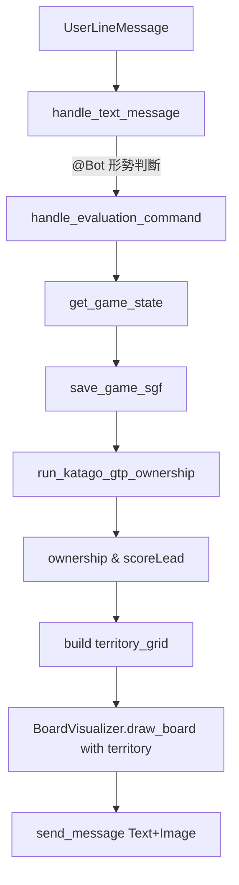

## 形勢判斷功能設計（先實作 `localhost_all`）

### 功能目標

- **指令入口**: 使用者在群組輸入 `@NTUGoBot 形勢判斷` 或 `@NTUGoBot evaluation`，只在有 mention 機制通過時觸發。
- **盤面來源**: 對 `localhost_all` 來說，直接沿用現有的 in-memory `game_states[target_id] `加上 `save_game_sgf(target_id)` 生成的 SGF（未碰 GCS 的 `game_state.json`，那部分留待 GCP 專案）。
- **KataGo 評估**: 針對「當前盤面」呼叫 KataGo，取得每個交叉點的 ownership（誰的地）、以及當前形勢（誰領先幾目）。
- **棋盤顯示**: 在現有的木板棋盤上，保留棋子及最後一手標記，再額外以顏色背景/半透明覆蓋標出黑地與白地。
- **回覆內容**: 文字顯示例如：`目前形勢：黑 +2.5 目`，並附上一張帶有黑白領地標示的棋盤圖。

---

### 1. KataGo 要用的指令（回答問題 1）

- **使用現有的 analysis engine pipeline（`katawrap + katago analysis`）**：
  - 啟動 KataGo 分析引擎：透過 `apps/localhost_all/katago/analysis.py` → `katago/scripts/analysis.sh` → `katawrap.py` → `katago analysis -config ... -model ...`。
  - 在傳給 analysis engine 的 JSON query 或 katawrap 參數中，啟用 `includeOwnership: true`，讓回傳 JSON 中包含：
    - `rootInfo.scoreLead`（以當前行棋方視角，>0 表示該方領先幾目）；
    - `rootInfo.winrate`（可選）；
    - `ownership` 或 `rootInfo.ownership` 陣列（長度 361、值域 -1~1，row-major，由左上 A19 到右下 T1）。
  - 只需要「最後一手棋」（當前盤面）的 ownership，因此會利用 katawrap 的查詢延伸欄位：
    - 方案一：在 JSON query 中設定 `analyzeLastTurn: true`（或 alias `last: true`），並搭配 `-only-last` 選項讓 katawrap 只分析終局盤面；
    - 方案二：明確指定 `analyzeTurnsFrom`、`analyzeTurnsTo`（或 alias `from`、`to`）為該局最後一手手數，只分析這一手。
  - 實作時以「只分析最後一手」為目標，避免像覆盤一樣對每一手都做完整分析，縮短等待時間。
  - 使用這一組 pipeline 來取得「當前盤面」的形勢與 ownership，而不依賴 GTP 的 `kata-analyze` 指令。

---

### 2. LINE 指令與 handler 介面

- **文字解析**（編輯 `apps/localhost_all/src/handlers/line_handler.py`）
  - 在 `handle_text_message` 中，於既有指令分支（例如 `覆盤` / `review`、`對弈` 等）下方新增：
    - 若 `text` 為 `"形勢判斷"`（全形）或 `"evaluation"`（不分大小寫），則：
      - 決定 `target_id = groupId/roomId/userId`，
      - 呼叫新的 `await handle_evaluation_command(target_id, reply_token)`。

- **新的 handler**：`handle_evaluation_command(target_id, reply_token)`（同檔案中實作）
  - 取得或建立遊戲狀態：`state = get_game_state(target_id)`，得出：
    - `game = state["game"]`（`GoBoard`，19x19 陣列），
    - `current_turn = state["current_turn"]`（1=黑, 2=白），
    - `sgf_game = state["sgf_game"]`。
  - 若尚未有任何落子（盤面全 0 或 SGF 無手），回覆：「目前盤面沒有棋局進行中，無法進行形勢判斷」。
  - 確保 SGF 檔存在：
    - 呼叫 `sgf_path = save_game_sgf(target_id)`；若失敗或檔案不存在則回錯誤訊息。
  - 呼叫新的 KataGo 封裝函式（見下一節）：
    - `result = await run_katago_analysis_evaluation(sgf_path, current_turn, visits=400)`。
    - 若 `result["success"]` 為 False，回傳錯誤訊息給 LINE 使用者。
  - 根據回傳：
    - `ownership_grid`: 19x19 的浮點數或整數矩陣（後面會轉成黑/白/中立），
    - `current_player`: `"B"` 或 `"W"`（KataGo 觀點），
    - `scoreLead`: 浮點數（以當前行棋方視角，>0 表示該方領先），
    - （可選）`winrate` 等欄位。

---

### 3. 新增 KataGo 擴充：ownership 取得邏輯

- **新函式位置**：在 `apps/localhost_all/src/handlers/katago_handler.py` 裡，`run_katago_analysis` 之後新增：

- **函式介面（概念）**：
  ```python
  async def run_katago_analysis_evaluation(
      sgf_path: str,
      current_turn: int,
      visits: Optional[int] = None,
  ) -> Dict[str, Any]:
      """
      使用既有 analysis pipeline 對 sgf_path 所代表的棋局做 KataGo 分析，
      取「目前盤面」那一手的 scoreLead + ownership，
      並轉成畫圖與文字回覆需要的格式。
      """
  ```

- **實作要點**：
  - 呼叫既有 `run_katago_analysis(sgf_path, visits=visits or 預設值)`：
    - 透過 `analysis.py` → `analysis.sh` → katawrap → `katago analysis`，產生 JSONL 結果並轉成 `moveStats` JSON。
    - `analysis.sh` / katawrap 呼叫會調整為只分析「最後一手」：
      - 例如在輸入 JSON 中加入 `{"sgfFile":"...", "analyzeLastTurn": true, "includeOwnership": true}`，
      - 或透過 katawrap 命令列選項 `-only-last`（加上 `-override` / `-default` 將 `includeOwnership` 打開）。
  - 取得唯一代表「目前盤面」的那一筆結果（因為已經只分析最後一手，JSONL 中應只對應單一 turn）：
    - 若仍保留多手分析作為備援，則以 `moveStats["moves"][-1]` 或 JSONL 最後一筆當作「目前盤面」。
  - 從該筆資料抽出：
    - `scoreLead`（以「當前行棋方」為視角）；
    - `ownership` 陣列（長度 361、-1~1），轉回 19x19 矩陣 `ownership_grid`。
  - **黑白陣地歸屬處理（threshold = 0.8）**：
    - `ownership` 數值是「以當前行棋方視角」：
      - 當 `current_turn == 1`（輪到黑）時：值 > 0 代表黑方有利、<0 代表白方有利。
      - 當 `current_turn == 2`（輪到白）時：相反。
    - 先保留原始 `ownership_grid`，再額外轉成整數矩陣 `territory_grid`：
      - 設 `threshold = 0.8`：
        - 若 `val > 0.8`：該點屬於「當前行棋方」領地。
        - 若 `val < -0.8`：該點屬於「對手」領地。
        - 介於 `[-0.8, 0.8]` 視為 0（中立/不確定）。
      - 再依 `current_turn` 映射到最終顏色：
        - 若 `current_turn == 1`（輪到黑，當前方=黑）：  
          - `val > 0.8` → `territory=1`（黑領地）  
          - `val < -0.8` → `territory=2`（白領地）
        - 若 `current_turn == 2`（輪到白，當前方=白）：  
          - `val > 0.8` → `territory=2`（白領地）  
          - `val < -0.8` → `territory=1`（黑領地）
  - **回傳結構**：
    ```python
    return {
        "success": True,
        "territory": territory_grid,  # 19x19, 0/1/2
        "ownership_raw": ownership_grid,  # 19x19, float
        "currentPlayer": "B" or "W",
        "scoreLead": score_lead,  # float，>0 表當前行棋方領先
        "winrate": winrate,       # 可選
    }
    ```


---

### 4. 棋盤畫出領地標示（擴充 `BoardVisualizer`）

- **介面擴充**（編輯 `apps/localhost_all/src/handlers/board_visualizer.py`）
  - 將 `draw_board` 函式簽名改為支援可選領地參數：
    ```python
    def draw_board(
        self,
        board_state,
        last_move=None,
        output_filename="current_board.png",
        move_numbers=None,
        territory=None,  # 新增：19x19 矩陣，0=中立,1=黑地,2=白地
    ):
    ```

  - 實作流程：

    1. **先畫棋子**（使用既有邏輯，不動）。
    2. **在棋子下/周邊畫領地底色**：

       - 若 `territory` 參數存在，loop `r,c`：
         - 若 `territory[r][c] == 1`（黑地）：在交叉點中心畫一個半透明深色圓（例如 RGBA `(0,0,0,80)`）。
         - 若 `territory[r][c] == 2`（白地）：畫一個半透明淺色圓（例如 RGBA `(255,255,255,100)`）。
       - 可先在 base board 上畫領地，再貼棋子，或反之用透明度控制；建議順序：先畫棋子，再用更大但透明度較低的圓蓋上，避免棋子被完全遮住但仍能看出顏色。實際實作時可在 plan 之後微調顏色與透明度。

    1. **保留原有 last_move 標記與 move_numbers 繪製邏輯不變**，僅在最後加入領地圖層之前/之後插入額外繪圖步驟。

- **產出檔案規劃**
  - 對 `handle_evaluation_command` 產生的圖檔，與其他棋盤圖維持一致：
    - 路徑類似：`static/{game_id}/evaluation_{target_id}_{timestamp}.png`。
  - `PUBLIC_URL` 與 URL 組裝沿用 `handle_board_move` / `handle_load_game_*` 的既有模式（`encode_url_path` 等）。

---

### 5. 組合結果並回覆 LINE（只改 `localhost_all`，回答問題 2）

- **文字訊息**（`handle_evaluation_command` 中）：
  - 利用 KataGo 回傳的 `scoreLead` 與 `current_turn` 換算成黑/白視角：
    - 若 `current_turn == 1`（輪到黑）且 `scoreLead > 0`：黑領先 `scoreLead` 目；若 `<0` 則白領先 `abs(scoreLead)` 目。
    - 若 `current_turn == 2`（輪到白）且 `scoreLead > 0`：白領先 `scoreLead` 目；若 `<0` 則黑領先 `abs(scoreLead)` 目。
  - 整理成簡潔文字，例如：`目前形勢：黑 +2.5 目` 或 `目前形勢：白 +1.0 目`，四捨五入到 0.5 或 0.1 目皆可（實作時再決定格式）。

- **圖片訊息**：
  - 呼叫 `visualizer.draw_board(game.board, last_move=last_coords, output_filename=..., territory=territory_grid)` 繪製圖檔，其中 `last_coords` 可從 SGF 序列最後一手求得（類似 `handle_load_game*` 的邏輯）。
  - 用 `PUBLIC_URL` 組圖檔 URL，建立一則 `ImageMessage`。

- **一次回覆組合**：
  - 用 `send_message` 或 `ReplyMessageRequest`，一次送出：
    - 一則 `TextMessage`（形勢文字），
    - 一則 `ImageMessage`（帶領地標示的棋盤）。

- **作用範圍限制在 `localhost_all`**：
  - 所有修改僅針對 `apps/localhost_all/src/handlers/*.py` 與 `apps/localhost_all/katago/*`（若需要小調整），不觸碰 `gcp_linebot_localhost_katago` 與 `gcp_linebot_modal_katago` 專案。
  - 未使用或依賴 `state/game_state.json`；未來當你要在另外兩個專案實作相同功能時，可以：
    - 從 GCS 依 `game_state.json` 取得 `game_id` 與 `current_turn`，
    - 讀取對應 SGF 檔（`boards/{game_id}/game.sgf`），
    - 直接重用這裡新增的 `run_katago_gtp_ownership` 與「領地繪圖」邏輯。

---

### 6. 簡要流程圖（KataGo 形勢判斷）

