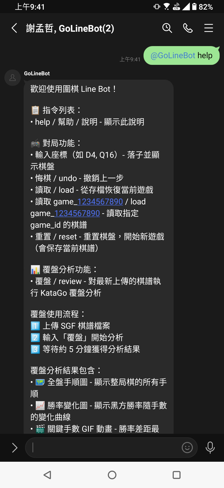
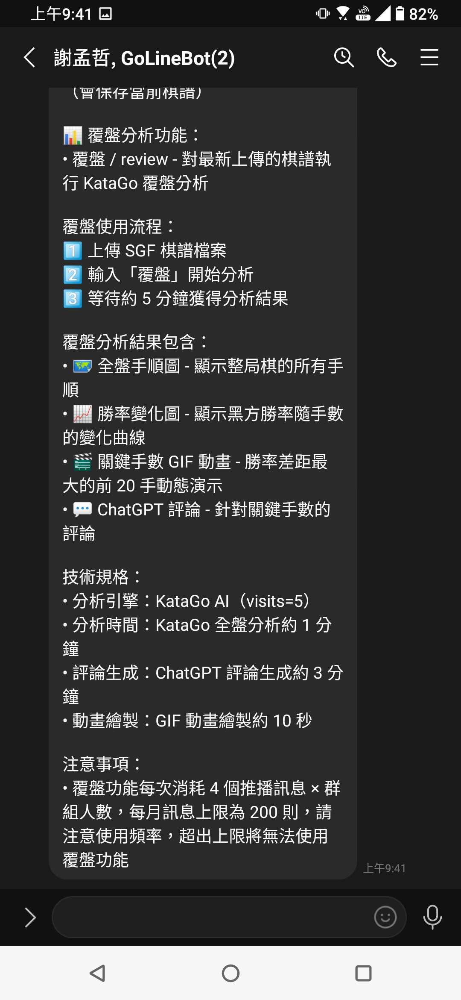
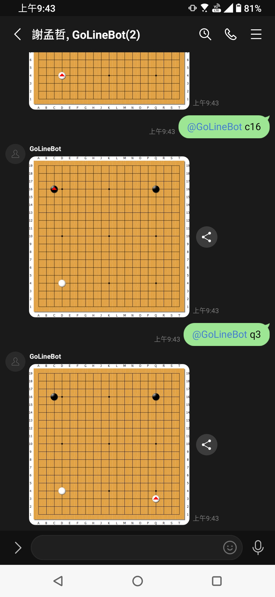
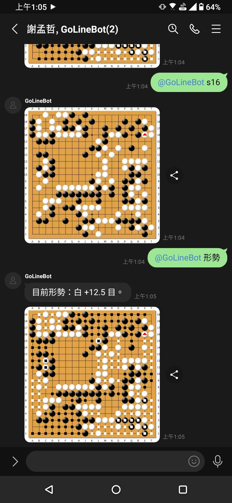
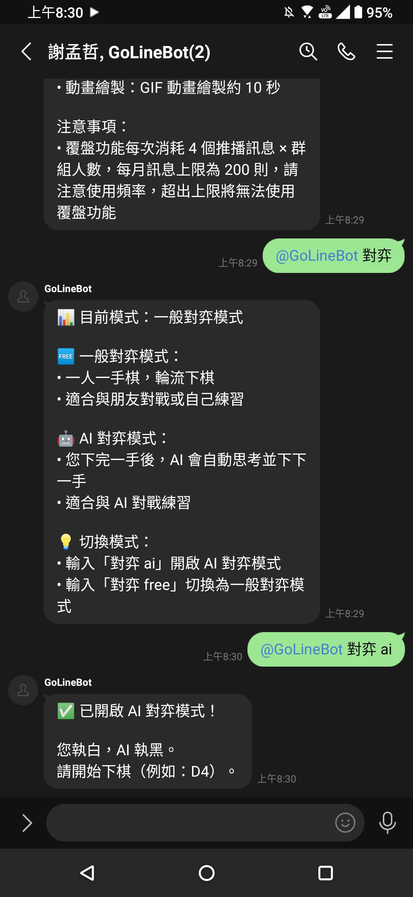
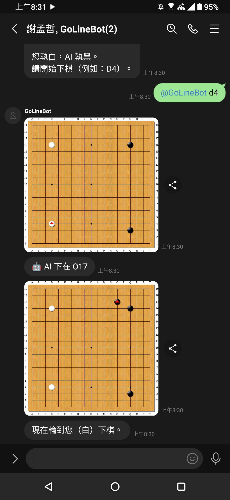
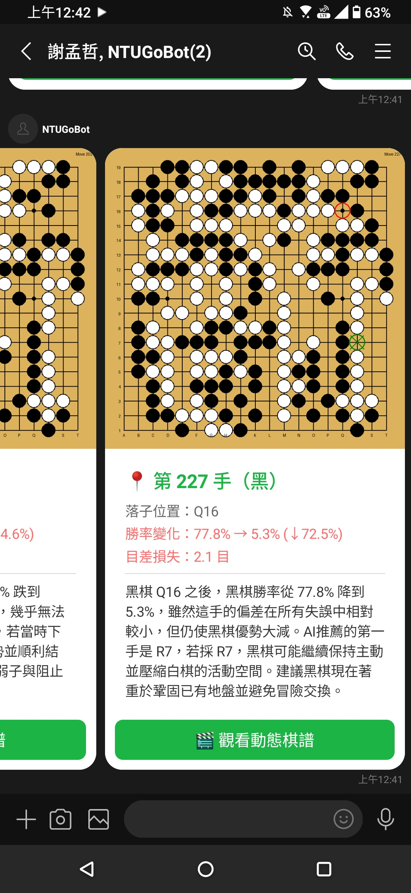
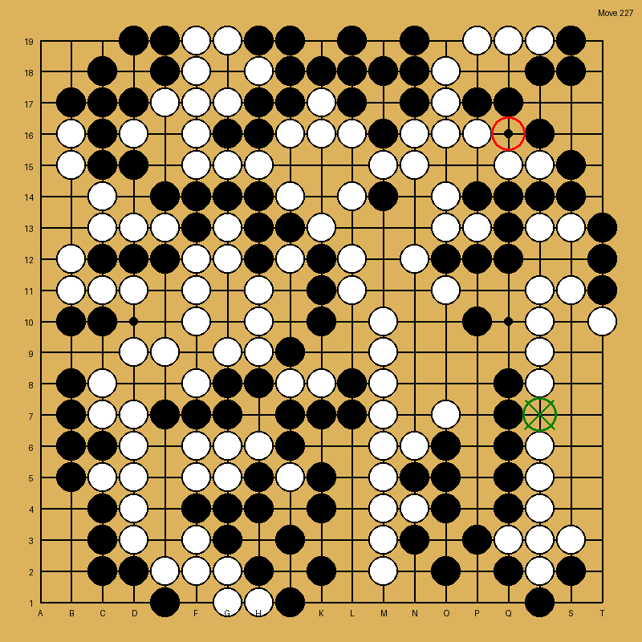

# Go LINE Bot - KataGo Analysis & Go Game

這是一個 LINE Bot，提供圍棋對弈和 KataGo AI 覆盤分析功能

## 功能特色

### 對弈功能

- 在 LINE 中直接下圍棋，輸入座標（如 D4, Q16）即可落子
- 自動判斷提子、打劫、禁手等圍棋規則
- 自動保存棋譜為 SGF 格式
- 支援悔棋功能
- 支援讀取和恢復已保存的對局
- 支援重置棋盤開始新局

### 形勢判斷功能

- 輸入「形勢」或「形式」或「evaluation」對當前盤面進行形勢判斷
- 顯示 KataGo 評估的領地分布圖（黑地/白地標示）與目數差距

### AI 對弈功能

- 與 KataGo AI 進行實時對戰
- 輸入「對弈 ai」開啟 AI 對弈模式
- 輸入「對弈 free」關閉 AI 對弈模式，恢復一般對弈模式
- 輸入「對弈」查看當前模式狀態
- AI 會自動思考並下下一步棋
- 系統會合併回傳用戶的棋盤圖片和 AI 的棋盤圖片

### 覆盤分析功能

- 透過 LINE Bot 接收 SGF 棋譜檔案
- 使用 KataGo 進行全盤覆盤分析
- 自動生成關鍵手數的 GIF 動畫
- 整合 ChatGPT 生成中文評論
- 支援多種部署架構（GCP Cloud Run、Modal、本地）

## 專案架構

本專案提供三種不同的架構，用於不同的使用場景：

### 1. `localhost_all` - 本地完整架構

**架構說明：**

- **所有服務**：全部在本地運行
- **包含功能**：LINE Bot Webhook、KataGo 分析、GIF 生成、LLM 評論

**適用場景：**

- 一開始進行本地開發和除錯
- 最省錢的方案，除了 LLM 評論外沒有額外花費

**詳細說明：** 請參考 [本地完整架構](apps/localhost_all/README.md)

### 2. `gcp_linebot_localhost_katago` - GCP + 本地 KataGo 分離架構

**架構說明：**

- **前端服務**：GCP Cloud Run 部署的 LINE Bot Webhook 服務
- **分析服務**：本地運行的 KataGo 分析服務
- **儲存**：使用 GCS (Google Cloud Storage) 儲存 SGF 檔案和分析結果

**適用場景：**

- 為了讓下棋功能全天運作將 LINE Bot 部署到雲端，但 KataGo 分析在本地執行

**詳細說明：** 請參考 [GCP + 本地 KataGo 分離架構](/apps/gcp_linebot_localhost_katago/README.md)

### 3. `gcp_linebot_modal_katago` - GCP + Modal KataGo 分離架構

**架構說明：**

- **前端服務**：GCP Cloud Run 部署的 LINE Bot Webhook 服務
- **分析服務**：[Modal 平台](https://modal.com/) 運行的 KataGo 分析服務

**適用場景：**

- 依靠本地電腦運行 KataGo 時間太長，Modal 平台 Starter 方案免費提供 $30/月 的運行時數，相較於本地可以將覆盤分析的時間變短

**詳細說明：** 請參考 [GCP + Modal KataGo 分離架構](apps/gcp_linebot_modal_katago/README.md)

## 使用方式

### 通用指令

- `help` / `幫助` / `說明` - 顯示完整功能說明

 

### 對弈功能

1. 在 LINE 中搜尋並加入您的 LINE Bot
2. 直接輸入座標開始下棋（例如：`D4`、`Q16`）
3. Bot 會自動：
   - 顯示當前棋盤狀態
   - 判斷落子是否合法（檢查提子、打劫、禁手等規則）
   - 自動保存棋譜為 SGF 格式
   - 輪流下黑白棋

**對弈指令：**

- 輸入座標（如 `D4`、`Q16`）- 落子並顯示棋盤
- `悔棋` / `undo` - 撤銷上一步
- `讀取` / `load` - 從存檔恢復當前遊戲
- `讀取 game_1234567890` / `load game_1234567890` - 讀取指定 game_id 的棋譜
- `讀取 game_1234567890 10` / `load game_1234567890 10` - 讀取指定 game_id 的前 10 手棋
- `重置` / `reset` - 重置棋盤，開始新遊戲（會保存當前棋譜）
- `投子` - 認輸並結束本局（先顯示勝負再重置棋盤）
- `形勢` / `形式` / `evaluation` - 顯示當前盤面領地分布與目數差距（形勢判斷）

### AI 對弈功能

1. 輸入 `對弈 ai` 或 `vs ai` 開啟 AI 對弈模式
2. 開始下棋（例如：`D4`）
3. AI 會自動思考並下下一步棋
4. 系統會合併回傳：
   - 用戶的棋盤圖片
   - AI 的棋盤圖片
   - AI 的落子位置文字訊息

**AI 對弈指令：**

- `對弈` / `vs` - 查看目前對弈模式狀態
- `對弈 ai` / `vs ai` - 開啟 AI 對弈模式（與 AI 對戰）
- `對弈 free` / `vs free` - 關閉 AI 對弈模式（恢復一般對弈模式）

**技術規格：**

- AI 引擎：KataGo GTP
- 思考時間：約 10 秒內
- 配置檔案：`default_gtp.cfg`

**注意事項：**

- AI 對弈模式啟用後，用戶下完棋後不會立即收到回覆，需等待 AI 思考完成
- 系統會合併回傳用戶的棋盤圖片和 AI 的棋盤圖片，以及 AI 的落子位置

 

### 覆盤分析功能

1. 上傳 `.sgf` 棋譜檔案
2. 發送文字指令 `覆盤`
3. Bot 會自動執行以下流程：
   - 解析 SGF 檔案
   - 執行 KataGo 全盤覆盤
   - 篩選關鍵手數（勝率差距最大的前 20 手）
   - 生成關鍵手數的 GIF 動畫
   - 使用 ChatGPT 生成中文評論
   - 回傳結果

**覆盤指令：**

- `覆盤` / `review` - 對最近上傳的 SGF 檔案進行覆盤分析

 

 

## 技術架構

- **後端框架**: FastAPI
- **LINE Bot SDK**: line-bot-sdk
- **圍棋引擎**: KataGo
- **LLM 評論**: ChatGPT
- **雲端服務**:
  - GCP Cloud Run (Webhook 服務)
  - GCP Cloud Storage (GCS) - 檔案儲存
  - Modal (GPU 計算平台)

## 開發心得

[go-linebot 開發心得](https://www.blog.bcjohn.com/2026/01/28/go-linebot-%E9%96%8B%E7%99%BC%E5%BF%83%E5%BE%97/) 分享了整個開發的過程

## License

MIT
